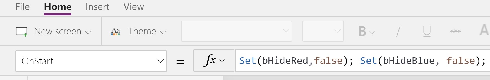

# TOGGLING VISIBILITY OF AN ITEM BASED ON WHETHER TEXT IS CONTAINED

# BUILD IT

* Create a new, blank, tablet app
* Navigate to Tree View -> App and set the OnStart action to:
```
Set(bHideRed,false); Set(bHideBlue, false);
```

* Add an image to the lower left
* Name it ImageRed.  
* Add a red type image to the lower left from your collection.
* Add an image to the lower right
* Name it ImageBlue.  
* Add a blue type image to the lower right.
* Add a TextInput to the top of the page.
* Set its OnChange action to 
```
Set( bHideRed, IsMatch( Lower(TextInput1.Text),"red" )); 
Set( bHideBlue, IsMatch( Lower(TextInput1.Text),"blue" ))
```
* Add a button to the top of the page.
* Add in a label, text set to "bHideRed.  
* Next to bHideRed add in a label, call it HideRedLabel.  Set its text property to bHideRed.
* Add in a label, Text property set to "bHideBlue". 
* Next to bHideBlue add in a label, call it HideBlueLabel.  Set its text property to bHideBlue.

The screen should resemble the following:


## TEST IT

* SAVE THE APP, SAVE THE APP, SAVE THE APP
* Then run it
* Type in "red" into the box, then hit tab
* The red art should disappear
* Type in "green" into the box, then hit tab
* both images should be visible
* Type in "blue" into the box, then hit tab
* The red image should be visible


If you need some images be sure to check out my public domain images repo at https://github.com/jhealy/awesome/blob/master/data.md.
